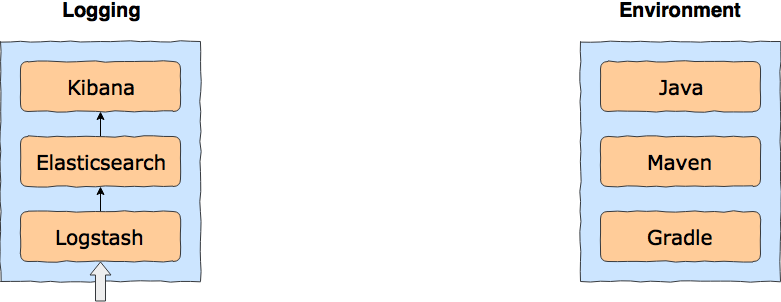

# docker-spring-micro-services
[](https://circleci.com/gh/bednar/docker-spring-micro-services)
[](https://registry.hub.docker.com/u/bednar/docker-spring-micro-services/)
[](https://registry.hub.docker.com/u/bednar/docker-spring-micro-services/)
[](https://registry.hub.docker.com/u/bednar/docker-spring-micro-services/)
[](https://raw.githubusercontent.com/bednar/docker-spring-micro-services/master/LICENSE)


The Docker image for developing micro services based on Spring Stream.

**Using the image, you accept the [Oracle Binary Code License Agreement](http://www.oracle.com/technetwork/java/javase/terms/license/index.html) for Java SE.**



## Elastic Stack - Elasticsearch, Logstash, and Kibana
### Elasticsearch
- Indexes - [http://localhost:9200/_cat/indices](http://localhost:9200/_cat/indices)
- Status - [http://localhost:9200/_cat/health](http://localhost:9200/_cat/health)
- REST API - [http://localhost:9200/_cat/](http://localhost:9200/_cat/)

### Logstash
### Kibana
 - [http://localhost:5601/](http://localhost:5601/)

## Couchbase Stack
### Couchbase Server

The Admin username is **Administrator** and the password is **changeme**.

- Couchbase Web console, REST/HTTP interface - [http://localhost:8091](http://localhost:8091)
- Views, queries, XDCR - [http://localhost:8092](http://localhost:8092)
- Query services - [http://localhost:8093](http://localhost:8093)
- Full-text Search - [http://localhost:8094](http://localhost:8094)

## Docker

### Build a Dockerfile and an Image
```bash
# Install the Groovy
brew install groovy

# Customise recipes versions
open versions.json

# Create the Dockerfile
groovy build.groovy

## Build the docker image
docker build -t "bednar:docker-spring-micro-services" .
```
## Run an Image
```bash
## Run the builded image in background
docker run -d -p 5601:5601 -p 9200:9200 -p 8091-8094:8091-8094 -t bednar:docker-spring-micro-services
```
